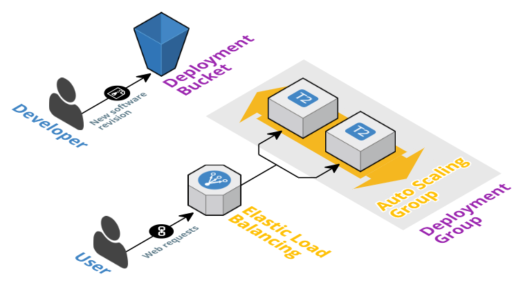

# codedeploy-example



# Getting started

```
npm run create-stack
```

```
cd webapp
npm install
npm run deploy-webapp -- webapp-1
```

# CodeDeploy

## Appspec

### Files

```
files:
  - source: src
    destination: /opt/webapp
  - source: node_modules
    destination: /opt/webapp/node_modules
```

[See AWS Documentation on files](http://docs.aws.amazon.com/codedeploy/latest/userguide/reference-appspec-file-structure-files.html)

### Hooks

```
hooks:
  ApplicationStop:
    - location: deployment_scripts/stop.sh
  AfterInstall:
    - location: deployment_scripts/deploy.sh
  ApplicationStart:
    - location: deployment_scripts/start.sh
```

[AWS Docs on hooks](http://docs.aws.amazon.com/codedeploy/latest/userguide/reference-appspec-file-structure-hooks.html)

## Deploy

```
cd webapp
npm install
npm run deploy-webapp -- webapp-1
```

# CloudFormation

## Create stack

```
aws cloudformation create-stack \
	--stack-name webapp-example \
	--template-body=file://webapp.cloudformation.yml \
	--capabilities CAPABILITY_IAM
```

Useful npm scripts:

```
npm run create-stack
npm run update-stack
npm run delete-stack
npm run remove-stack
npm run describe-stack
npm run describe-stack-events
npm run wait-stack-delete
npm run wait-stack-remove
npm run wait-stack-create
npm run wait-stack-update
npm run wait-stack-exists
```
