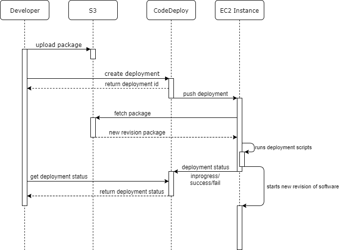
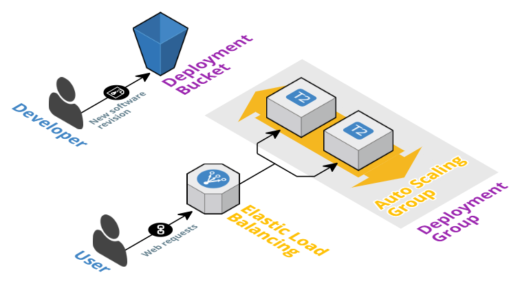

# AWS CodeDeploy Example

This project will demonstrate the basics of deploying an application to an Auto Scaled EC2 instance with CodeDeploy. The infrastructure
is setup is automated with CloudFormation. A NodeJS Express application will serve as a dummy application. Dependencies are preinstalled
into the AMI with Packer.

# Prerequisites

You should have the [aws cli](http://docs.aws.amazon.com/cli/latest/userguide/awscli-install-bundle.html) installed and [configured with your
AWS credentials](http://docs.aws.amazon.com/cli/latest/userguide/cli-chap-getting-started.html). [NodeJS and npm](https://nodejs.org/en/) are also
required to run the example app.

You should also change the default values for the CloudFormation template. You could do this during the stack creation command but that's
tedious, so I find it easied to just modify the `Parameters` section in `webapp.cloudformation.yml`. See *CloudFormation* section for more info.

# Getting started

Well start off by creating a stack of AWS resources that we're going to use to serve our application. Use the AWS CLI to create a CloudFormation
stack from `webapp.cloudformation.yml`.

```
aws cloudformation create-stack \
	--stack-name webapp-example \
	--template-body=file://webapp.cloudformation.yml \
	--capabilities CAPABILITY_IAM
```

Next we'll deploy our sample `webapp`. It's a simple Express application written in NodeJS so you'll need to install it's dependencies with npm.

```
cd webapp
npm install
```

To deploy our application we'll use aws cli to create a zip file of our sources and push it to S3.

```
# in project root
aws deploy push --application-name $APPLICATION_NAME \
	--s3-location s3://$DEPLOYMENT_BUCKET/$REVISION \
	--source webapp
```

Replace `$APPLICATION_NAME`, `$DEPLOYMENT_BUCKET` and `$REVISION` with your values. Revision can be anything but it should include an incrementing
version number, e.g. `webapp-1, webapp-2, webapp-3...`.
You can obtain the application name and deployment bucket from the example webapp stack's outputs with the following command.

```
aws cloudformation describe-stacks --stack-name webapp-example
```

Once you've pushed your new revision package to S3, the command will output a command that you can use to deploy the application to a deployment group.
It will look something like this:

```
aws deploy create-deployment --application-name $APPLICATION_NAME \
	--s3-location bucket="$DEPLOYMENT_BUCKET",key="$REVISION",bundleType=zip \
	--deployment-group-name $DEPLOYMENT_GROUP
```

That command will create a new deployment in CodeDeploy. The CodeDeploy agent on your instances will notice this and download the new revision.
See *CodeDeploy* section for more info.

## Scripting

Since it's somewhat tedious to be writing all of that all the time, it pays to have a script do it for you. The `scripts` folder contains a script
that will do all of the above in one step.

```
../scripts/deploy-webapp.sh webapp-1
```

Alternatively, you can use the convenient npm scripts registered in the scripts section of `package.json`:

```
npm run create-stack
...
npm run deploy-webapp -- webapp-1
```

npm scripts like these can be configured in the scripts section of `package.json`.

# CodeDeploy

Below is a simplified chart of a deployment workflow. 



## Appspec

`appspec.yml` is a file used to tell CodeDeploy how to install your application. You can find this in the root of `webapp` folder which will be packaged
as a zip archive and uploaded to S3.

### Files

The files section is used to copy files from your package to where ever you need to copy them in order for your application to function.
In this example we'll copy the contents of `src` folder to `/opt/webapp`. Since NodeJS applications need their libraries to run, we'll copy
`node_modules` to the same location as well.

```
files:
  - source: src
    destination: /opt/webapp
  - source: node_modules
    destination: /opt/webapp/node_modules
```

[See AWS Documentation on files](http://docs.aws.amazon.com/codedeploy/latest/userguide/reference-appspec-file-structure-files.html)

### Hooks

Hooks are used to run scripts during various stages of the deployment. Here we'll use the `AfterInstall` hook to install our application as a `systemd`
service and `ApplicationStart` and `ApplicationStop` hooks to start and stop our application with `systemctl`.

```
hooks:
  ApplicationStop:
    - location: deployment_scripts/stop.sh
  AfterInstall:
    - location: deployment_scripts/deploy.sh
  ApplicationStart:
    - location: deployment_scripts/start.sh
```

These scripts are located in the `webapp/deployment_scripts` folder.

[AWS Docs on hooks](http://docs.aws.amazon.com/codedeploy/latest/userguide/reference-appspec-file-structure-hooks.html)

## Deploy

As described in the *Getting started* section we can use the `aws` cli tool to create a zip package of our applications
source code and push it to S3.

```
aws deploy push --application-name $APPLICATION_NAME \
	--s3-location s3://$DEPLOYMENT_BUCKET/$REVISION \
	--source webapp
```

However, you don't need to use `aws` cli for this. You can use any method to create a zip or tar.gz archive. `tar` is especially useful
when you source code is not all in one convenient folder that you can zip up. The `--transform` flag on `tar` can be used to rename
files inside the archive. For example say you have your appspec.yml in a folder called `codedeploy` instead of project root where CodeDeploy
will look for it, you could use the `--transform` to move it in the package, e.g.

```
tar -czf package.tar.gz --transform="s|webapp/codedeploy/appspec.yml|appspec.yml|" webapp
```

The command above will output a gzipped tar archive called `package.tar.gz` with the appspec moved to the root:

```
webapp/
webapp/codedeploy/
appspec.yml
webapp/deployment_scripts/
webapp/deployment_scripts/deploy.sh
...
```

Note that this repository actually has the appspec.yml in the `webapp` folder so the above isn't necessary here.

You can use `aws` cli to upload your package to S3.

```
aws s3 cp package.tar.gz s3://$DEPLOYMENT_BUCKET/$REVISION
```

To deploy your application you can either go to the AWS CodeDeploy console or use the `aws` cli. Using the command line
tool is highly recommended since it can easily be scripted thus easing development.

```
aws deploy create-deployment --application-name $APPLICATION_NAME \
	--s3-location bucket="$DEPLOYMENT_BUCKET",key="$REVISION",bundleType=zip \
	--deployment-group-name $DEPLOYMENT_GROUP
```

Depending on your package type change the `bundleType` parameter to one of `tar`, `tgz` or `zip`.

### Scripting

As described in *Getting started* section, it's convenient to automated all of this with a script. The `scripts` folder
contains a script called `deploy-webapp.sh` that will fetch the required details from your CloudFormation stack, create
the package, upload it to S3 and create a deployment with CodeDeploy.

If you're using npm or a similar system with configurable scripts you should add your scripts there as well. This will further
ease development. With package.json for example you could configure the scripts section as follows.

```
  "scripts": {
    "deploy-webapp": "bash scripts/deploy-webapp.sh"
  },
```

Now you can run `npm run deploy-webapp -- revision-1` to deploy your application. The `--` denotes that all arguments after that
will be passed to the script.

You can easily use this to create a Continuous Deployment setup. For example, you could run a bash scripts something like this
on a some CI.

```
cd webapp
npm install
npm run test

if [ $BRANCH == "master" ]; then
	npm run deploy-webapp -- webapp-$BUILD_NUMBER $PROD_DEPLOYMENT_GROUP
elif [ $BRANCH == "develop" ]; then
	npm run deploy-webapp -- webapp-$BUILD_NUMBER $TEST_DEPLOYMENT_GROUP
fi
```

You should run tests for all of your branches.

We could extend `deploy-webapp.sh` script to accept a deployment group as a parameter and use an `if` statement to conditionally
deploy to different environments based on branch.

# CloudFormation

Managing AWS resources is easy with CloudFormation. We describe the resources we want as an YAML file and CloudFormation will
create them for us with a single command. Updating and removing them is as simple. This is called infrastructure as code and
the benefit is having your infrastructure versioned just like your code.



## Default parameters

You should change the default parameters for the CloudFormation stack. You can do this during stack creation but that's tedious.
The default parameters are an easy way of storing your AWS details. This template however will have mine which wont work for you.
So edit the `Parameters` section of `webapp.cloudformation.yml` with your AWS details and all of the commands described here will
work without modifition.

You should at least change `KeyName`, `WebappSubnets`, `ALBSubnets`, `VPC` and `AMIID`. You can register an SSH key at AWS EC2 console.
The default VPC and subnets found under the AWS VPC console will do just fine. The AMI id can be obtained by building the Amazon Machine
image with Packer. See *EC2* section for more info on building the AMI.

## Create stack

We'll use the `aws` cli tool to create the stack.

```
aws cloudformation create-stack \
	--stack-name webapp-example \
	--template-body=file://webapp.cloudformation.yml \
	--capabilities CAPABILITY_IAM
```

However that's a bit cumbersome to type out every time so `package.json` contains a bunch of handful scripts, e.g.

```
npm run create-stack
```

## Remove stack

To remove the stack you'll first need to clean up the S3 deployment bucket. CloudFormation will refuse to delete buckets
that are not empty.

```
npm run cleanup-s3
npm run remove-stack
```

## Useful npm scripts

Typing out those `aws` cli commands can be a chore sometimes so the `package.json` contains a set of scripts for dealing
with various lifycycle events. They should be pretty self explanatory so here's a listing of them.

```
npm run create-stack
npm run update-stack
npm run delete-stack
npm run remove-stack
npm run describe-stack
npm run describe-stack-events
npm run wait-stack-delete
npm run wait-stack-remove
npm run wait-stack-create
npm run wait-stack-update
npm run wait-stack-exists
```

The commands called `wait-stack-*` can be used to wait for a certain stack event to complete. For example, wait for your
stack to be created before pushing deployment. This is very useful in scripts. e.g.

```
npm run create-stack && npm run wait-stack-create && npm run deploy-webapp -- webapp-1
```

# EC2

We'll run our Webapp on an Auto Scaling Group with EC2 instances. For this we're going to need an Amazon Machine Image
(AMI) with our dependencies installed. Things like the CodeDeploy agent and NodeJS. We could simply install these during
the application deployment but that would increase the deployment time. It would also be error prone due to the possibility
of OS vendors package repositories being offline for example.

## Build AMI with Packer

Packer is perfect for creating AMIs with software preinstalled in a repeatable fashion.

```
packer build webapp.packer.json
```

# License

Copyright 2017 Nikolas Lahtinen

Permission to use, copy, modify, and/or distribute this software for any purpose with or without fee is hereby granted, provided that the above copyright notice and this permission notice appear in all copies.

THE SOFTWARE IS PROVIDED "AS IS" AND THE AUTHOR DISCLAIMS ALL WARRANTIES WITH REGARD TO THIS SOFTWARE INCLUDING ALL IMPLIED WARRANTIES OF MERCHANTABILITY AND FITNESS. IN NO EVENT SHALL THE AUTHOR BE LIABLE FOR ANY SPECIAL, DIRECT, INDIRECT, OR CONSEQUENTIAL DAMAGES OR ANY DAMAGES WHATSOEVER RESULTING FROM LOSS OF USE, DATA OR PROFITS, WHETHER IN AN ACTION OF CONTRACT, NEGLIGENCE OR OTHER TORTIOUS ACTION, ARISING OUT OF OR IN CONNECTION WITH THE USE OR PERFORMANCE OF THIS SOFTWARE.